<div align="center">

<!-- Animated Header -->


<!-- Typing Animation -->
<a href="https://git.io/typing-svg"></a>

<!-- Social Badges -->
<p align="center">
  <a href="mailto:mdshahriaalam2@gmail.com">
    
  </a>
  <a href="https://www.linkedin.com/in/mdshahriaalam2">
    
  </a>
  <a href="https://mdshahriaalam-portfolio.netlify.app/">
    
  </a>
  <a href="https://www.coursera.org/learner/md-shahria-alam">
    
  </a>
</p>

<!-- Profile Views Counter -->
<p align="center">
  
  
</p>

</div>

---

## 🚀 About Me

```python
class MdShahriaAlam:
    def __init__(self):
        self.name = "Md Shahria Alam"
        self.role = "Network Engineer & Developer"
        self.location = "Cumilla, Bangladesh 🇧🇩"
        self.education = "Bachelor's (Hons) - Computer Science"
        self.language_spoken = ["Bengali", "English", "Hindi", "Urdu"]
        
    def current_focus(self):
        return [
            "Building CCNA lab collections",
            "Mastering network automation",
            "Exploring cybersecurity & ethical hacking",
            "Contributing to open-source projects"
        ]
    
    def life_philosophy(self):
        return "Learning to code is like solving puzzles; every problem solved brings accomplishment! 🧩"
```

<details>
<summary>📖 <b>More About My Journey</b></summary>
<br>

I'm a **self-taught technology enthusiast** with 4+ years of hands-on experience in programming and networking. Without formal IT training, I've cultivated my technical skills through independent learning and practical application. My passion for technology drives me to continuously explore new domains:

- 🌐 **Networking**: CCNA-certified path, Cisco Packet Tracer expert
- 💻 **Development**: Full-stack web development, Python automation
- 🔐 **Security**: Ethical hacking basics, bug bounty hunting
- 🎨 **Design**: Adobe Creative Suite for graphics and multimedia
- 🤝 **Community**: Active volunteer in blood donation and environmental causes

I believe in **learning by doing** and love to share knowledge through open-source contributions!

</details>

---

## 🛠️ Tech Stack & Tools

<div align="center">

### 💻 Programming Languages


### 🌐 Web Development


### 🗄️ Database & Backend


### 🔧 Networking & Security


### 🎨 Design Tools


### 🖥️ Operating Systems


### 📊 Productivity Tools


</div>

---

## 📊 GitHub Statistics

<div align="center">
  
  
</div>

<div align="center">
  
</div>

<div align="center">
  
</div>

---

## 🏆 GitHub Trophies

<div align="center">
  
</div>

---

## 🚀 Featured Projects

<div align="center">

<a href="https://github.com/mdshahriaalam2/CCNA-PacketTracer-Labs">
  
</a>

<a href="https://github.com/mdshahriaalam2/EuroWeather-Pro">
  
</a>

</div>

### 🌟 Project Highlights

<table align="center">
  <tr>
    <td align="center" width="50%">
      <h4>🌐 CCNA Packet Tracer Labs</h4>
      <p>Comprehensive collection of 15+ networking labs covering CCNA topics from basics to advanced configurations</p>
      <a href="https://github.com/mdshahriaalam2/CCNA-PacketTracer-Labs">
        
      </a>
    </td>
    <td align="center" width="50%">
      <h4>☁️ EuroWeather Pro</h4>
      <p>Modern weather app with 7-day forecasts for European cities, featuring live API integration</p>
      <a href="https://euroweather.netlify.app/">
        
      </a>
    </td>
  </tr>
  <tr>
    <td align="center" width="50%">
      <h4>💼 Portfolio Website</h4>
      <p>Personal portfolio showcasing projects, skills, and experience with modern design</p>
      <a href="https://mdshahriaalam-portfolio.netlify.app/">
        
      </a>
    </td>
    <td align="center" width="50%">
      <h4>🔐 Cybersecurity Tools</h4>
      <p>Ethical hacking scripts and security automation tools (Burp Suite, Kali Linux)</p>
      <a href="https://github.com/mdshahriaalam2?tab=repositories">
        
      </a>
    </td>
  </tr>
</table>

---

## 📜 Certifications & Achievements

<div align="center">

| 🎓 Certification | 🏢 Issuing Organization | 📅 Date |
|-----------------|------------------------|---------|
| 🔐 **Digital Security Essentials** | National Cyber Security Agency, Bangladesh | Nov 2021 |
| 🌐 **National Portal Management** | Muktopaath (Government of Bangladesh) | 2022 |
| 🧠 **Social Psychology** | Wesleyan University (Coursera) | 2025 |
| 💼 **Computer Operator** | Union Parishad, Cumilla | 2022-2023 |

</div>

---

## 🤝 Community Involvement

<div align="center">

### 🩸 Badhon Blood Donation Group
*Volunteer | July 2024 - Present*

Organizing blood donation campaigns and emergency support services across Cumilla

### 🌱 BD Clean Cumilla
*Environmental Volunteer | March 2024 - Present*

Led cleanliness drives and planted **300,000+ trees** in community sustainability initiatives

<a href="https://www.tbsnews.net/bangladesh/bd-clean-celebrates-anniversary-planting-300000-trees-two-hours-644554">
  
</a>

</div>

---

## 💼 Professional Experience

**💻 Computer Operator** | Union Parishad, Cumilla  
*October 2022 - December 2023*

- 🌐 Managed website updates and digital content management
- 🔧 Troubleshot network connectivity issues
- 📊 Created reports and presentations using MS Office Suite
- 🎨 Designed graphics using Adobe Photoshop

---

## 📚 Current Focus & Learning

```mermaid
mindmap
  root((Md Shahria Alam))
    🌐 Networking
      CCNA Certification
      Network Automation
      Cisco Technologies
    💻 Development
      Full Stack Web Dev
      Python Automation
      API Integration
    🔐 Security
      Ethical Hacking
      Penetration Testing
      Bug Bounty Hunting
    🎓 Education
      Computer Science
      Online Courses
      Hands-on Projects
```

<div align="center">



</div>

**Currently Exploring:**
- 🔹 Advanced routing protocols (OSPF, EIGRP, BGP)
- 🔹 Network automation with Python (Netmiko, NAPALM)
- 🔹 Cloud technologies (AWS, Azure networking)
- 🔹 DevOps fundamentals and CI/CD pipelines
- 🔹 Advanced cybersecurity techniques

---

## 🎯 2025 Goals

- [ ] 🏅 Complete CCNA certification
- [ ] 🚀 Contribute to 50+ open-source projects
- [ ] 📝 Write technical blogs on networking and development
- [ ] 🌐 Build a network automation toolkit
- [ ] 🔐 Participate in bug bounty programs
- [ ] 🎓 Complete Bachelor's degree in Computer Science

---

## 💡 Fun Facts About Me

<div align="center">

| 🎯 Category | 💫 Details |
|------------|-----------|
| 🏏 **Sports** | Cricket enthusiast & player |
| 🎬 **Entertainment** | Cinema, Animation & Photography |
| 🍳 **Hobbies** | Cooking & Exploring cuisines |
| ✈️ **Travel** | Love exploring new places |
| 📚 **Reading** | Psychology of Money, Atomic Habits, Deep Work |
| 🗣️ **Languages** | Fluent in 4 languages |
| ⚡ **Philosophy** | Every problem is a puzzle waiting to be solved! |

</div>

---

## 📫 Let's Connect!

<div align="center">

I'm always open to interesting conversations and collaboration opportunities!

<a href="mailto:mdshahriaalam2@gmail.com">
  
</a>
<a href="https://www.linkedin.com/in/mdshahriaalam2">
  
</a>
<a href="https://mdshahriaalam-portfolio.netlify.app/">
  
</a>

### 💬 Ask me about:
**Networking** • **Python** • **Web Development** • **Cybersecurity** • **CCNA Labs** • **Open Source**

### 🤝 Open to collaborate on:
**Network Automation Projects** • **Educational Content** • **Open Source Initiatives** • **Community Building**

</div>

---

## 📈 Coding Activity

<!--START_SECTION:waka-->
<!--END_SECTION:waka-->

<div align="center">

### 📊 Weekly Development Breakdown

```text
Networking    ████████████░░░░░░░░░   55.2%
Python        ██████░░░░░░░░░░░░░░░   25.8%
Web Dev       ████░░░░░░░░░░░░░░░░░   15.4%
Other         ██░░░░░░░░░░░░░░░░░░░    3.6%
```

</div>

---

## 🐍 Contribution Snake

<div align="center">
  
</div>

---

<div align="center">

### 💭 Random Dev Quote


### 😄 Here's a random joke to brighten your day!


---


**⭐ If you find my projects interesting, consider giving them a star!**

**🤝 Open to collaboration and networking opportunities**

*Last Updated: December 2024*

</div>
